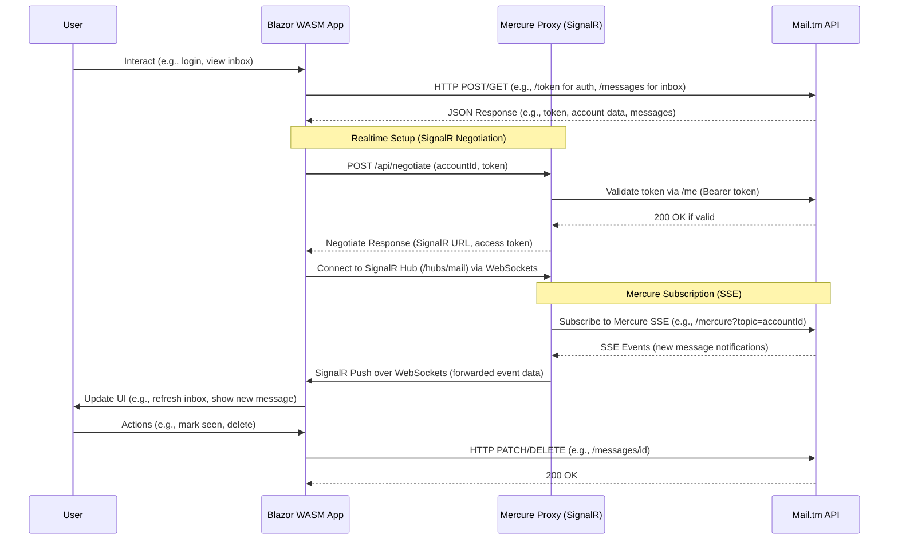

# MailTmBlazor

## Overview

MailTmBlazor is a Blazor WebAssembly application that serves as a temporary email client integrated with the Mail.tm API. It allows users to create temporary email accounts, manage inboxes, view and interact with messages, and receive realtime updates for new emails. The project includes a frontend Blazor app for the user interface, a backend proxy for handling realtime notifications, comprehensive testing (unit and end-to-end), and CI workflows for automated testing.

Key technologies:
- C# and .NET (Blazor WASM, ASP.NET Core)
- SignalR for realtime communication
- HTTP clients and JSON configuration
- Playwright for end-to-end testing
- Azure SignalR for scalable messaging

## Functionality

- **Authentication**: Register new accounts or log in to existing ones using the Mail.tm API.
- **Domain Management**: List available domains for creating email addresses.
- **Inbox Management**: View, mark as seen, delete messages; display message details (subject, sender, content, attachments).
- **Realtime Updates**: Subscribe to notifications for new messages via a proxy that bridges Mercure protocol (SSE) to SignalR/WebSockets.
- **UI Components**: Blazor pages like Inbox.razor for email listing, Auth.razor for login, and others for domains and user info.
- **Session Handling**: Uses local storage to persist authentication tokens.

The app redirects from home to inbox and handles errors gracefully (e.g., loading states, error messages).

## Architecture and Flow

The system involves the Blazor app interacting directly with the Mail.tm API for core operations and using a proxy for realtime features. The proxy subscribes to Mail.tm's Mercure SSE stream and forwards events to clients via SignalR (primarily over WebSockets).

Here's a sequence diagram illustrating the flow:



## Testing

The project includes robust testing to ensure reliability:

- **Unit Tests**: Located in `tests/MailTmBlazor.Tests/`. Covers authentication (e.g., LocalStorageAccountSessionTests), API mappers (MailTmMapperTests), form models (AuthFormModelTests), and sanity checks. Run with `dotnet test`.
- **Playwright End-to-End Tests**: In `tests/MailTmBlazor.PlaywrightTests/` (C#) and `tests/playwright-js/` (JavaScript). Tests home page functionality, informational pages, account operations, and clipboard interactions. Requires browsers installed via Playwright. Run with `dotnet test` for C# or `npx playwright test` for JS.
- **Sample Data**: Includes weather.json for demo purposes.

## CI/CD

Continuous Integration is handled via GitHub Actions in `.github/workflows/tests.yml`. The workflow runs on pushes to main/feature branches and pull requests:

- Sets up .NET and Node.js.
- Restores, builds, and publishes the Blazor app.
- Runs unit tests.
- Serves the app locally (if PLAYWRIGHT_BASE_URL is set to local) and waits for it to be ready.
- Installs Playwright browsers and runs both C# and JS Playwright tests.
- Cleans up resources post-test.

Secrets like PLAYWRIGHT_BASE_URL are used for configuration. The workflow ensures tests pass before merges.

## Setup and Running

### Prerequisites
- .NET SDK 10.0+
- Node.js 20+ (for Playwright JS tests)
- Azure SignalR connection string (for the proxy)

### Local Development
1. Clone the repo.
2. Configure `appsettings.json` with Mail.tm API and proxy URLs.
3. Run the Blazor app: `dotnet run --project MailTmBlazor/MailTmBlazor.csproj`
4. Run the proxy: `dotnet run --project MercureProxy.Web/MercureProxy.Web.csproj`
5. For tests: `dotnet test` or navigate to test directories.

### Deployment
- Publish Blazor to a static host (e.g., Azure Static Web Apps).
- Deploy the proxy to a server supporting ASP.NET Core (e.g., Azure App Service) with SignalR configured.

For issues or contributions, check the GitHub repo.


## Running Tests Locally

### Prerequisites
- Ensure .NET SDK and Node.js are installed.
- Build the project: `dotnet build MailTmBlazor.sln`
- For Playwright tests, install browsers:
  - For .NET: `pwsh tests/MailTmBlazor.PlaywrightTests/bin/Release/net10.0/playwright.ps1 install --with-deps` (after building)
  - For JS: `cd tests/playwright-js && npx playwright install --with-deps`

### Unit Tests
Run from the root directory:
```
dotnet test tests/MailTmBlazor.Tests/MailTmBlazor.Tests.csproj --configuration Release
```

### Playwright .NET Tests
These are end-to-end tests. Optionally, serve the app locally first (e.g., using `npx serve -s artifacts/frontend/wwwroot -l 5004` after publishing with `dotnet publish MailTmBlazor/MailTmBlazor.csproj --configuration Release --output artifacts/frontend`).

Then run:
```
dotnet test tests/MailTmBlazor.PlaywrightTests/MailTmBlazor.PlaywrightTests.csproj --configuration Release
```
Set `PLAYWRIGHT_BASE_URL` environment variable if testing against a specific URL (e.g., `export PLAYWRIGHT_BASE_URL=http://localhost:5004`).

### Playwright JS Tests
Navigate to the directory:
```
cd tests/playwright-js
npm install
npx playwright test
```
Clean auth state if needed: `rm -rf .auth`.

For all tests, ensure any required environment variables (e.g., API URLs) are set in appsettings.json or via environment.


## Roadmap / Future Features

The following features are planned for future implementation to enhance the application:

- [ ] **Localization (Locales)**
- [ ] **Dark/Light Theme Toggle**
- [ ] **UI Improvements**
- [ ] **Increased Code Coverage**
- [ ] **Expose Metrics for Azure Monitor**

Contributions or suggestions for these features are welcome!
